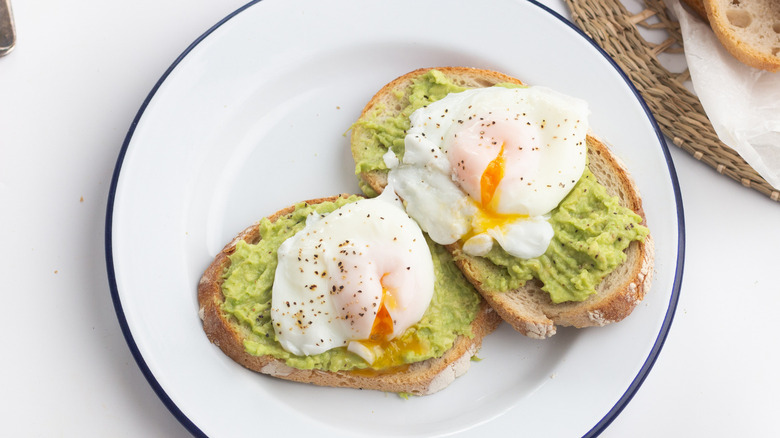

# Nicholas' Avocado Toast

This is Avocado Toast with eggs and honey, so I put my name before the recipe.

### Ingredients: 
- Bread (2 Slices)
- Avocado (1 whole)
- Eggs (2)
- Butter
- Salt
- Pepper
- Honey

### Instructions:

1. Place butter in a pan and heat it. Move the pan around so that the melted butter coats the entire surface. This helps prevent the eggs from sticking. (Disclaimer: They can still stick to your pan)
2. Once the pan is coated with melted butter, crack the eggs into the pan separately, keeping the yolks intact. Let the eggs cook. 
3. Toast the bread slices, but remove them so that they are slightly toasted with a bit of crunch.
4. Cut the avocado in half and spread half of the avocado on each slice of bread. 
5. By now, the eggs should be ready to flip. If they don't move easily, let them cook a bit longer. When ready, use a spatula to separate the egg whites if they've joined forces, then flip them.
6. Let the eggs cook for just under a minute. Once done, place them on top of the avocado-coated bread slices. 
7. Add salt, pepper, and honey. Or don't.
8. You are done.

Duplicate for a title attribute test

do in html later